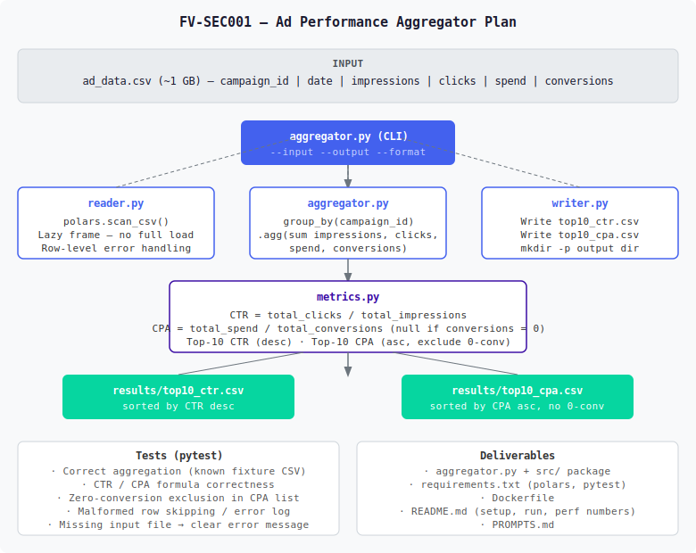

# PROMPTS.md — Working With an AI Assistant

---

## Phase 1 — Understand the problem before writing any code

> Read README files, analyze the requirements in detail and give me a concrete
> implementation plan before writing code

I had the assistant fully digest the challenge: the CSV schema, the CTR/CPA definitions,
the zero-conversion rule, and — most importantly — the ~1 GB size constraint that makes
memory strategy the central design concern.

**Outcome:** A detailed plan landed on **Python + Polars**, using `scan_csv()` for lazy,
streaming reads so the full file is never materialised in memory. The plan also laid out a
small, single-responsibility `src/` package, a test strategy, and the full list of
deliverables. The assistant rendered the design as an architecture diagram:

---

## Phase 2 — Implement a clean, tested first version

> Confirm, let's go

I split the implementation into focused modules — `reader` (I/O + validation),
`aggregator` (the group-by pipeline), `metrics` (top-10 ranking), and `writer` (output) —
behind a thin `argparse` CLI, matching the challenge's example invocation
(`python aggregator.py --input ad_data.csv --output results/`).

**Outcome:** A working CLI plus a 22-case `pytest` suite covering aggregation correctness,
the CTR/CPA formulas, zero-conversion exclusion, malformed-row handling, and the
missing-file error path. All tests passed, and an end-to-end run on a known fixture
produced correctly ranked output.

---

## Phase 3 — Review the assistant critically

> why you modify their readme file ?

A useful reminder that AI output needs supervision: at one point the assistant replaced the
**provided** `README.md` with solution docs. I caught it and had the original restored
verbatim, relocating my own documentation to a separate `SOLUTION.md`. The challenge files
should stay exactly as the company shipped them.

**Outcome:** Original `README.md` restored; solution write-up moved to `SOLUTION.md`.

---

## Phase 4 — Make it reproducible with Docker

> can you make this run into docker instead of install in my local

To make evaluation friction-free, I added a `Dockerfile` and a `docker-compose.yml` with
dedicated services for running the aggregator, the test suite, and the benchmark — each
mounting the project so results land back on the host. While wiring this up I caught two
real footguns: a single-file bind mount that silently created a phantom `ad_data.csv`
*directory*, and a `test` service running a **stale baked image** instead of live source
(it was quietly hiding newly added tests). Both were fixed.

**Outcome:** `docker compose run --rm aggregator | test | benchmark` — no local install
needed; tests always reflect current source.

---

## Phase 5 — Get the real dataset working

> got this while unzip data file: Archive:  ad_data.csv.zip
  End-of-central-directory signature not found.  Either this file is not
  a zipfile, or it constitutes one disk of a multi-part archive.  In the
  latter case the central directory and zipfile comment will be found on
  the last disk(s) of this archive.
unzip:  cannot find zipfile directory in one of ad_data.csv.zip or
        ad_data.csv.zip.zip, and cannot find ad_data.csv.zip.ZIP, period.

The "zip" was a **134-byte Git LFS pointer**, not the archive — `git-lfs` simply wasn't
installed. I installed it, pulled the real 346 MB archive, and unzipped it to the full
**995 MB / 26.8M-row** dataset, then ran the pipeline against it for real.

**Outcome:** End-to-end run on the genuine dataset: 50 campaigns, correct top-10 outputs.

---

## Phase 6 — Match the expected output format exactly

> I see that the results in readme is different with our result, can you check it ?

I verified the README's tables are *illustrative format examples* (fabricated campaigns,
labelled "Expected output **format**"), so our values are correct — but our output dumped
full float precision, including artefacts like `...9600003`. I aligned the output to the
README's intended format: **CTR to 4 decimals, CPA and spend to 2**, trailing zeros
preserved, applied only at write time so ranking still uses full precision.

**Outcome:** Output now matches the documented format; two extra tests lock the formatting
in (24 tests total).

---

## Phase 7 — Provide benchmark evidence

> do we have Benchmark logs ?

I built a small benchmark harness that records environment details, runs multiple timed
trials, and reports time, throughput, and peak RSS — then captured a side-by-side
streaming-vs-eager comparison.

**Outcome:** [`docs/benchmark.log`](docs/benchmark.log) documents the ~35% memory win with
no speed cost, backing the engine choice with data rather than assertion.

---

